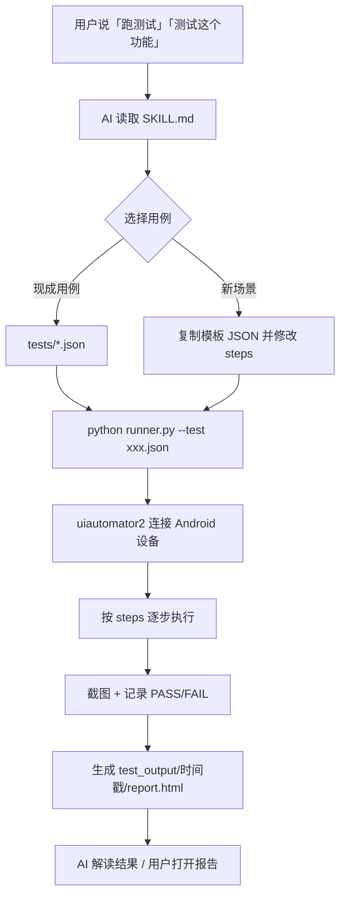
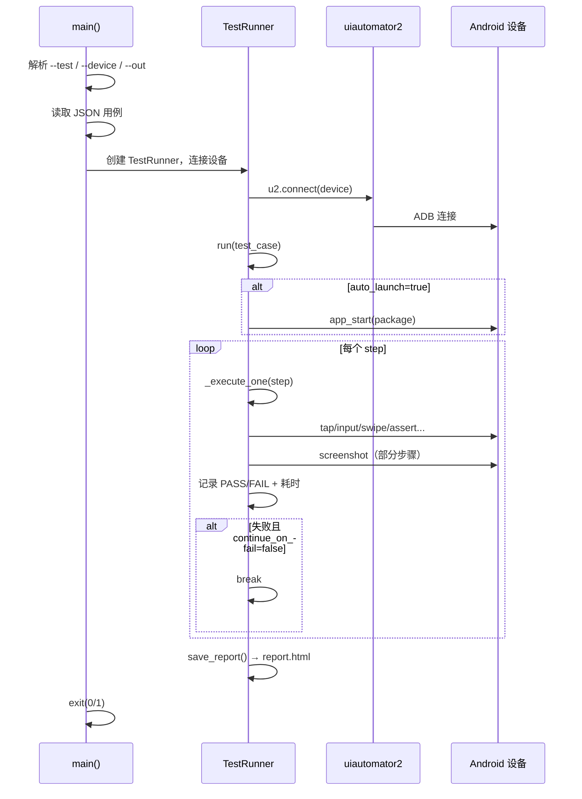

# Android UI Test Worker

通过 **JSON 用例 + uiautomator2 执行器** 实现 Android 设备自动化测试。使用说明见 [SKILL.md](./SKILL.md)。

## 整体架构



## 执行阶段（runner.py）



## 快速开始

```bash
cd android-ui-test-worker
python -u runner.py --test tests/test_add_image.json
```
