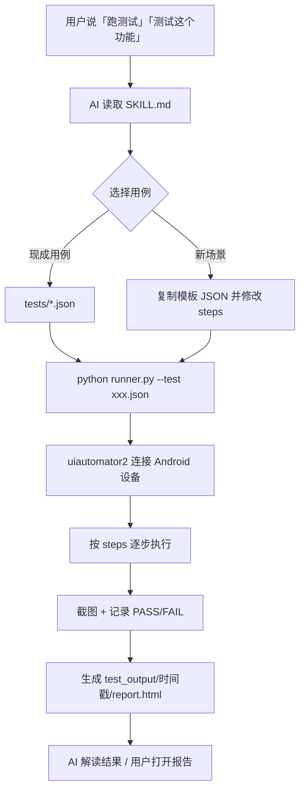
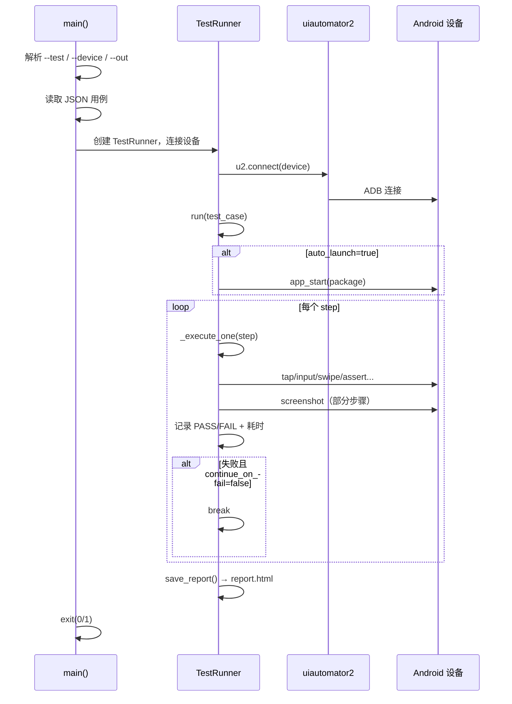

# Android UI Test Worker

通过 **可复用Task用例 + python uiautomator2 执行器** 实现 Android 设备自动化测试。使用说明见 [SKILL.md](./SKILL.md)。

**优点：**

1. 脚本采用渐进式披露，简洁高效；

2. 基于python uiautomator2 ATX技术，丰富的Action；

   | Action                 | 必填参数            | 可选参数       | 说明                                  |
   | ---------------------- | ------------------- | -------------- | ------------------------------------- |
   | `launch`               | `package`           | `stop`, `wait` | 启动 App                              |
   | `tap`                  | `selector`, `by`    | `wait`         | 点击元素                              |
   | `long_press`           | `selector`, `by`    | `wait`         | 长按                                  |
   | `input`                | `text`              | `index`        | 输入文本（index 指定第几个 EditText） |
   | `clear`                | -                   | `index`        | 清空输入框                            |
   | `swipe`                | `x1`,`y1`,`x2`,`y2` | `duration`     | 滑动                                  |
   | `back`                 | -                   | -              | 返回键                                |
   | `press`                | `key`               | -              | 按键（home/back/menu 等）             |
   | `wait`                 | `ms`                | -              | 等待（毫秒）                          |
   | `screenshot`           | `name`              | -              | 截图                                  |
   | `assert_exists`        | `selector`, `by`    | -              | 断言元素存在                          |
   | `assert_not_exists`    | `selector`, `by`    | -              | 断言元素不存在                        |
   | `assert_text_contains` | `text`              | -              | 断言 UI 树包含文本                    |
   | `log`                  | `message`           | -              | 输出日志                              |

3. 不依赖模型的OCR能力，中低端模型也能有良好的体验（非常的省Token）；

4. 测试过程归档，自动生成可视化report；

   

5. 生成Task可复用，减少用例冗余。


**使用姿势：**

1. 开发完功能进行自动化测试；
2. 放在Harness工程中作为“Evaluator”的一个环节进行验收；
3. 放在Loop中扮演“自动化评估”的重要角色。

**使用群体：**

1. 开发同学：开发完一个功能，告诉Agent：我要测试xxx；

2. 测试同学：要测试的用例太多，用这个skill分解成Task，然后全部丢给Agent，提高测试效率；

3. 产品同学：要开很多很多会，UI验收来不及做怎么办？丢给Agent，验收完自动归档生成报告，开完会直接看报告。

   

## 整体架构



## 执行阶段（runner.py）



## 快速开始

```bash
cd android-ui-test-worker
python -u runner.py --test tests/test_add_image.json
```
